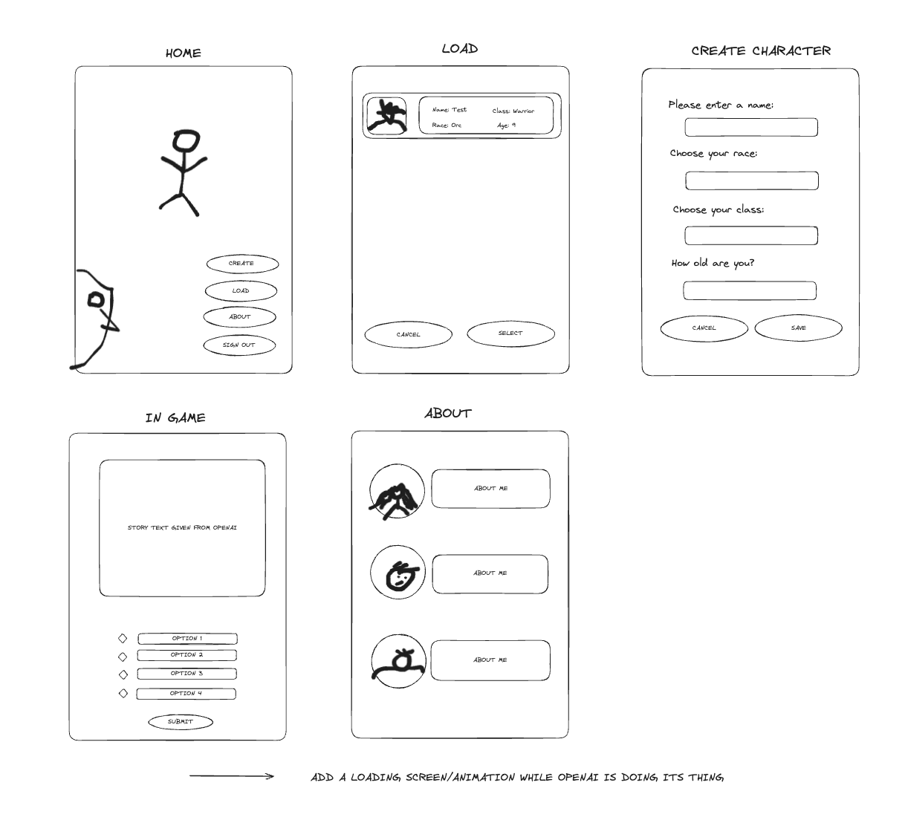

# Wireframes

## User Stories

- I want to experience a rich, branching storyline so that each decision I make in the game deeply impacts the outcome.
- I seek to customize my character not just in appearance and class, but also in backstory and personal quests, so I can immerse myself in a narrative that feels personal and unique to my character's journey.
- I want to be able to load the characters i previously created
- As a player, I want the ability to save my progress in the game and resume my adventure later. This ensures that I can enjoy the game at my own pace, accommodating interruptions in my gameplay while maintaining the continuity of my character's story.
- As a user, I want to start a new choose-your-own-adventure game, where I am presented with an intriguing story and face decisions that impact the outcome of the narrative. This allows me to immerse myself in a captivating D&D-style world and shape the destiny of my character.

## Domain Modeling
